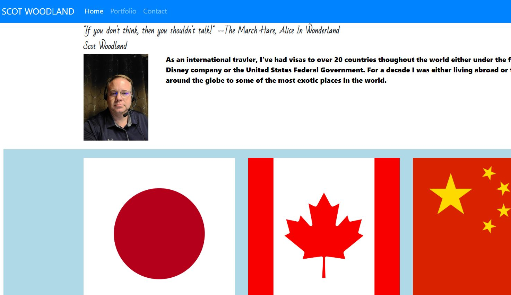

# Responsive Portfolio

## Description

While heavily relying on Bootstrap I created three pages with corresponding links that give a brief portfolio, (as I understand a portfolio), highlighting some of the positions I've held and places I've lived during my career. I attempted to use the grid sysmem as much as possible in the formatting of the pages and was able to find most of what I needed from Bootstrap. Some trainings on Youtube also assisted in some coding suggestions specifically in the "contact.html" page. I only have one social media site and found that I may need to begin opening additional accounts. Additionally, I learned a lot of things that you SHOULDN'T do as I went through .html validation through validator.w3.org. 

### Screenshot

#### Link to Deployed Application
[Responsive Portfolio "Main Page" Link](https://scotwoodland.github.io/Responsive_Portfolio/) is hosted on Github pages.
[Responsive Portfolio "Portfolio" Link](https://scotwoodland.github.io/Responsive_Portfolio/portfolio.html) is hosted on Github pages.
[Responsive Portfolio "Contacts" Link](https://scotwoodland.github.io/Responsive_Portfolio/contact.html) is hosted on Github pages.

##### Credit
[24: Forms In HTML and CSS | How To Create A Form | Learn HTML and CSS | HTML Tutorial | CSS Tutorial] (https://www.youtube.com/watch?v=E5MEzC0prd4);

[Learn HTML Forms In 25 Minutes] (https://www.youtube.com/watch?v=fNcJuPIZ2WE)

This application was authored by Scot Woodland.